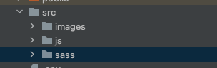

important links 
- https://laravel.com/docs/8.x/mix
- https://tailwindcss.com/docs/installation

run this command

-> first make one empty folder with your project name. (hit this command)
    - yarn add laravel-mix
-> then after set your folder structure. 

-> after create your package. json file with this command.
    - npm init -y

- yarn add tailwind 
  (make your tailwind.config file with this command)
- npx tailwindcss init

- then create webpack.mix.js file
  
  
- npx mix
- npx mix watch

