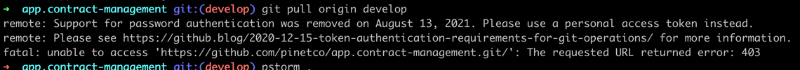

# Support for password authentication was removed:
If you are getting same error like this:


then follow the below step
- Open your project directory on terminal
- Developer's hack (shortcode):
````
git remote set-url origin git@github.com:<repositoryname>.git
````

- While cloning:
````angular2html
git clone https://<username>:<githubtoken>@github.com/<username>/<repositoryname>.git
````
