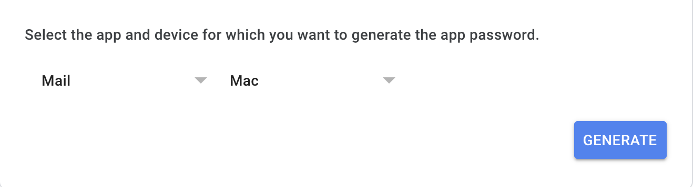
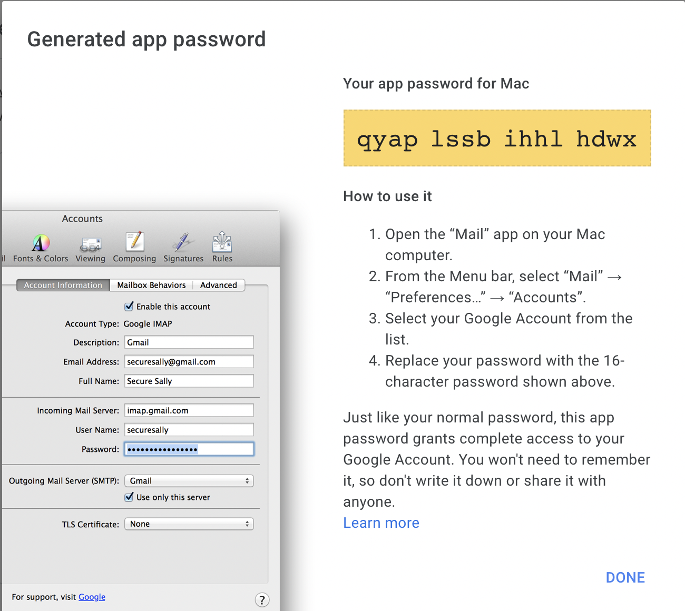

##Send Mails Using Gmail Account.

### follow below steps to send email from the gmail account.

- generate `app_password` for your gmail account from the below link.
https://myaccount.google.com/apppasswords?rapt=AEjHL4OKD2eWpf9IhjqbMYsslDbtLZdQAkLih6Dt7dAFBs0s9W41NkypGKsmNCSkK1oK8SJOpw9LVqu5E59Oc8gJDrfqFJXzUg
  
- select app and device to generate app password and click on generate.



- after clicking on generate, your `app_password` will be generated, just copy your `app_password` and store it on secure place, because once it will lost, you have to generate new `app_password`.



- after that, update your project's mail env variables.
```phpregexp
MAIL_MAILER=smtp
MAIL_HOST=smtp.gmail.com
MAIL_PORT=587
MAIL_USERNAME=your@gmail.com
MAIL_PASSWORD=app_password
MAIL_ENCRYPTION=tls
MAIL_FROM_ADDRESS=your@gmail.com
MAIL_FROM_NAME="${APP_NAME}"
```
- all set well, clear cache and try to send mail.
```phpregexp
php artisan optimize
```


  