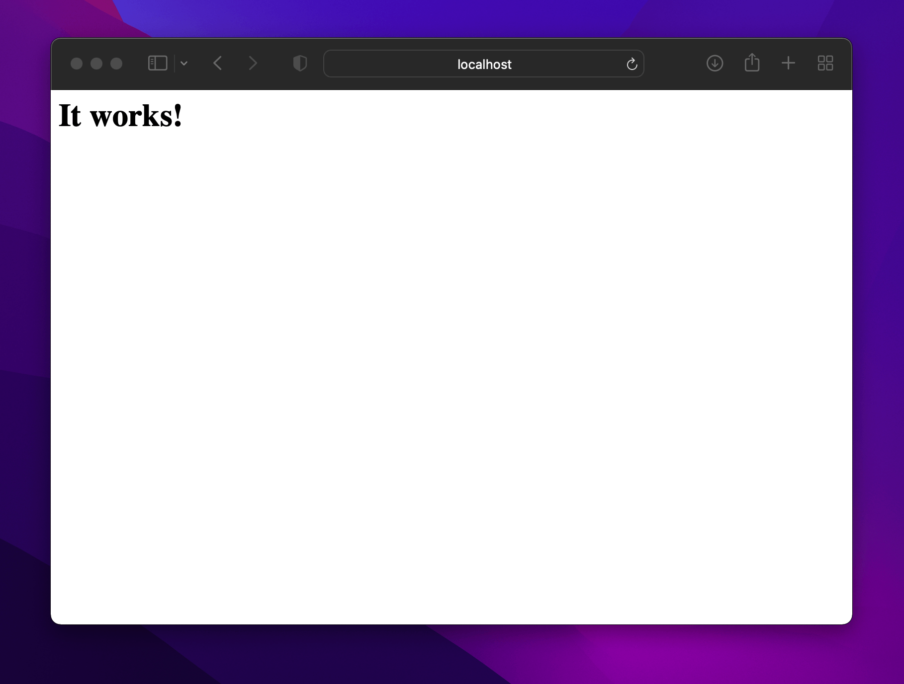
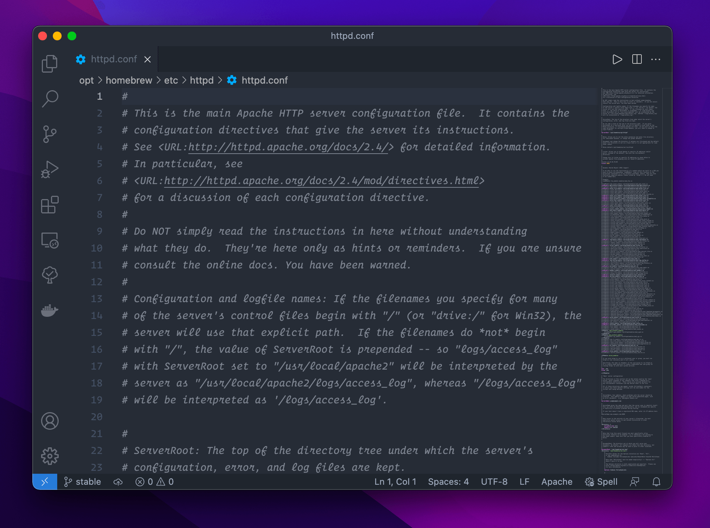
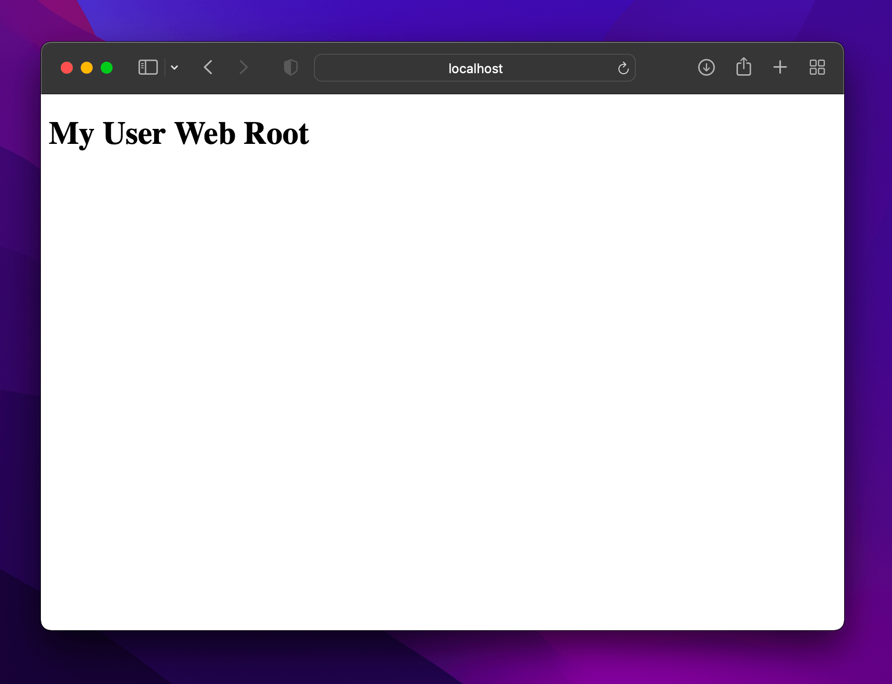

# Mac OS Setup

Follow this Steps 
- homebrew install
- Apache install
- php install
- composer install gobally
- yarn install gobally 
- install mySQL

## Homebrew install
https://getgrav.org/blog/macos-monterey-apache-multiple-php-versions

- documentation Link
  ````
   https://getgrav.org/blog/macos-monterey-apache-multiple-php-versions
   ````
  
- Commands
  
  ````
  /bin/bash -c "$(curl -fsSL https://raw.githubusercontent.com/Homebrew/install/master/install.sh)"
  ````

    - Just follow the terminal prompts and enter your password where required. This may take a few minutes.
    
    - If this is a fresh install and you don't have your path setup properly, you can follow the installation "next steps" which are already customized for you, or you can manually add the following paths to your `.bashrc` or `.zshrc`:
  
  ````
  eval "$(/opt/homebrew/bin/brew shellenv)"
  ````

- Now you can test your installation to ensure you have installed brew correctly, simply type:
  ````
  brew doctor
  ````

## Apache Installation

- If you already have the built-in Apache running, it will need to be shutdown first, and any auto-loading scripts removed. It really doesn't hurt to just run all these commands in order - even if it's a fresh installation:

  ````
  sudo apachectl stop
  sudo launchctl unload -w /System/Library/LaunchDaemons/org.apache.httpd.plist 2>/dev/null
  ````

- Now we need to install the new version provided by Brew:

  ````
  brew install httpd
  ````

-  Without options, `httpd` won't need to be built from source, so it installs pretty quickly. Upon completion you should see a message like:
   
  ````
  🍺  /opt/homebrew/Cellar/httpd/2.4.51: 1,660 files, 32.0MB
  ````

- Now we just need to configure things so that our new Apache server is auto-started
  ````
  brew services start httpd
  ````

- You now have installed Homebrew's Apache, and configured it to auto-start with a privileged account. It should already be running, so you can try to reach your server in a browser by pointing it at `http://localhost:8080`, you should see a simple header that says "It works!".



### Apache Configuration

- Now that we have a working web server, we will want to do is make some configuration changes so it works better as a local development server.

- In the latest version of Brew, you have to manually set the listen port from the default of `8080` to `80`, so we will need to edit Apache's configuration file `/opt/homebrew/etc/httpd/httpd.conf`.

- If you followed the instructions above you should be able to use **Visual Studio Code** to edit your files using the `code` Terminal command. However, if you want to use the default **TextEditor** application to perform edits, you can use the `open -e` command followed by the path to the file.
  ````
  code /opt/homebrew/etc/httpd/httpd.conf
  ````



- Find the line that says
  ````
  Listen 8080
  ````
- and change it to `80`:
  ````
  Listen 80
  ````
  

- Next we'll configure it to use the to change the **document root** for Apache. This is the folder where Apache looks to serve file from. By default, the document root is configured as `/opt/homebrew/var/www`. As this is a development machine, let's assume we want to change the document root to point to a folder in our own home directory.

- Search for the term `DocumentRoot`, and you should see the following line:
  ````
  DocumentRoot "/opt/homebrew/var/www"
  ````

- Change this to point to your user directory where `your_user` is the name of your user account:
  ````
  DocumentRoot "/Users/your_user/Sites"
  ````

- You also need to change the `<Directory>` tag reference right below the DocumentRoot line. This should also be changed to point to your new document root also:
  ````
  <Directory "/Users/your_user/Sites">
  ````
  
- In that same `<Directory>` block you will find an `AllowOverride` setting, this should be changed as follows:
  ````
  #
  # AllowOverride controls what directives may be placed in .htaccess files.
  # It can be "All", "None", or any combination of the keywords:
  #   AllowOverride FileInfo AuthConfig Limit
  #
  AllowOverride All
  ````

- Also we should now enable **mod_rewrite** which is commented out by default. Search for `mod_rewrite.so` and uncomment the line by removing the leading `#` by pushing `⌘` + `/` on the line (this is a quick way to uncomment and comment a single or multiple lines:
  ````
  LoadModule rewrite_module lib/httpd/modules/mod_rewrite.so
  ````

### Servername

- Apache likes to have a server name in the configuration, but this is disabled by default, so search for:

  ````
  #ServerName www.example.com:8080
  ````

- and replace it with:

  ````
  ServerName localhost
  ````
  


### Sites Folder

- Now, you need to create a `Sites` folder in the root of your home directory. You can do this in your terminal, or in Finder. In this new `Sites` folder create a simple `index.html` and put some dummy content in it like: `<h1>My User Web Root</h1>`.

  ````
  mkdir ~/Sites
  echo "<h1>My User Web Root</h1>" > ~/Sites/index.html
  ````

- Restart apache to ensure your configuration changes have taken effect:

  ````
  brew services stop httpd
  brew services start httpd
  ````

- Pointing your browser to `http://localhost` should display your new message. If you have that working, we can move on!




## PHP Installation
  ````
  php -v
  ````

### Apache PHP Setup - Part 1

- You have successfully installed your PHP versions, but we need to tell Apache to use them. You will again need to edit the `/opt/homebrew/etc/httpd/httpd.conf` file scroll to the bottom of the `LoadModule` entries.

- If you have been following this guide correctly, the last entry should be your `mod_rewrite` module:
  
  ````
  LoadModule rewrite_module lib/httpd/modules/mod_rewrite.so
  ````


- Below this add the following `libphp` modules:

  ````
  #LoadModule php7_module /opt/homebrew/opt/php@7.0/lib/httpd/modules/libphp7.so
  #LoadModule php7_module /opt/homebrew/opt/php@7.1/lib/httpd/modules/libphp7.so
  #LoadModule php7_module /opt/homebrew/opt/php@7.2/lib/httpd/modules/libphp7.so
  #LoadModule php7_module /opt/homebrew/opt/php@7.3/lib/httpd/modules/libphp7.so
  LoadModule php7_module /opt/homebrew/opt/php@7.4/lib/httpd/modules/libphp7.so
  #LoadModule php_module /opt/homebrew/opt/php@8.0/lib/httpd/modules/libphp.so
  ````

- We can only have one module processing PHP at a time, so for now, so we have left our `php@7.4` entry uncommented while all the others are commented out. This will tell Apache to use PHP 7.4 to handle PHP requests. **(We will add the ability to switch PHP versions later)**.

- Also you must set the Directory Indexes for PHP explicitly, so search for this block:

  ````
  <IfModule dir_module>
    DirectoryIndex index.html
  </IfModule>
  ````
- and replace it with this:

  ````
  <IfModule dir_module>
      DirectoryIndex index.php index.html
  </IfModule>
  
  <FilesMatch \.php$>
      SetHandler application/x-httpd-php
  </FilesMatch>
  ````
- Save the file and stop Apache then start again, now that we have installed PHP:
  ````
    brew services stop httpd
    brew services start httpd
  ````

## composer install gobally
https://getcomposer.org/download/

- run this command
  ````
  php -r "copy('https://getcomposer.org/installer', 'composer-setup.php');"
  php -r "if (hash_file('sha384', 'composer-setup.php') === '906a84df04cea2aa72f40b5f787e49f22d4c2f19492ac310e8cba5b96ac8b64115ac402c8cd292b8a03482574915d1a8') { echo 'Installer verified'; } else { echo 'Installer corrupt'; unlink('composer-setup.php'); } echo PHP_EOL;"
  php composer-setup.php
  php -r "unlink('composer-setup.php');"
  ````
  
- Most likely, you want to put the composer.phar into a directory on your PATH, so you can simply call composer from any directory (Global install), using for example:

  ````
  sudo mv composer.phar /usr/local/bin/composer
  ````
  

## yarn install gobally
https://www.digitalocean.com/community/tutorials/how-to-install-and-use-the-yarn-package-manager-for-node-js

- First Install Node.js  
    https://nodejs.org/en/download/

  ````
  node -v
  ````
- Installing Yarn Globally
  ````
    sudo npm install -g yarn
  ````
  ````
    yarn --version
  ````

## install mySQL
https://flaviocopes.com/mysql-how-to-install/

  ````
    brew install mysql
  ````
- You can now start the MySQL server by running:

  ````
    brew services start mysqls
  ````

  ````
    brew services stop mysql
  ````

  ````
    mysql.server start
  ````

- Now you can connect to the server using the command:

  ````
  mysql -u root -p
  ````
  
### Download Table Plus

https://tableplus.com/


### install laravel
https://laravel.com/docs/7.x/installation


### install vuejs globally 
https://cli.vuejs.org/guide/installation.html


# Enjoy 


