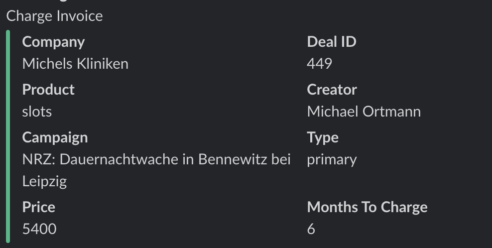

## Charge Slot Invoice



###Steps to generate slot invoice

1. Find deal in the deals table by using `dealId`.
2. Filter all transactions of with similar `amount`.
3. Note `transactionId` (transaction -> id) of latest created transaction.  
4. Execute below code block by passing `transactionId` and `months` to charge.
```
    config()->set('roadheroes.tax_rate', 19);
    setLanguage('de');
    CustomScripts::slotInvoice(oldTransactionId, Months);
```
